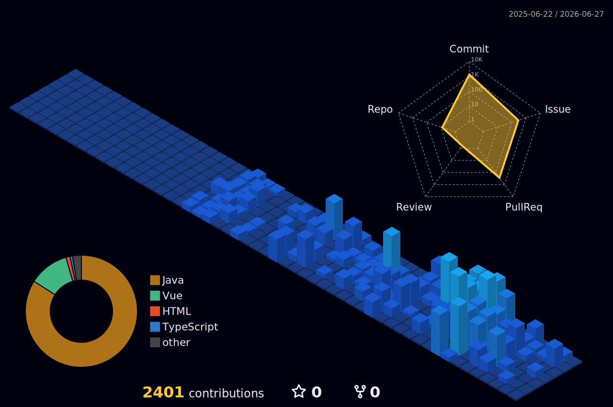

<!-- 헤더 타이핑 애니메이션 -->

  

 

  

---

## 👨‍💻 About Me

   
  <i>"항상 <b>'이 코드가 최선인가?'</b>를 스스로에게 묻습니다."</i>
    

**🎯 아키텍처와 성능에 진심인 백엔드 엔지니어**
> 단순히 돌아가는 코드를 넘어, 사용자에게 실질적인 가치를 제공하는 **서비스**를 만드는 것에 큰 매력을 느낍니다. 
> 보완할 점을 찾고, 개선하고, 다시 질문하는 과정을 즐기며, 무중단 배포 · TPS 개선 · 시스템 아키텍처를 끊임없이 고민합니다.

**🎓 Education & Certifications**
- 🏫 **한화시스템 BEYOND SW 캠프 24기** (2024.12 ~ 진행 중)
- 🏫 **KH 정보교육원 국비 과정 수료** (2023)
- 🏅 **정보처리산업기사** | **SQLD** - 🧩 **백준 Gold V** (꾸준한 알고리즘 문제 풀이 및 로직 최적화 훈련)

**🔥 Currently Focusing On**
- `Java`와 `Spring` 생태계를 깊이 있게 파고들며 기초를 다집니다.
- 대규모 트래픽 처리를 위한 `Network` 및 `System Design`을 학습하고 적용합니다.

---

  

---

## 🧩 Algorithm

  
  &nbsp;
  

---

## 🛠️ Tech Stack

**Backend**

**Frontend**

**Database**

**Infra & DevOps**

**Tools**

---

## 🚀 Projects

### 🚕 TalleMalle — 카풀 동승 모집 플랫폼

> **한화시스템 BEYOND SW 캠프 3차 프로젝트** | 팀 saraITne (5인) | 담당: **Recruit(모집) 도메인 백엔드 개발 & 성능 개선**

-%F0%9F%9A%80)

**서비스 개요**

출발지·목적지가 유사한 승객들이 모집글을 통해 카풀을 구성하고 기사와 실시간 매칭되는 택시 동승 플랫폼.
WebSocket(STOMP) 기반 실시간 알림, JWT + OAuth2 인증, 토스 결제, AWS 인프라까지 구축.

`Spring Boot 3` `JPA/Hibernate` `Spring Security` `JWT` `OAuth2` `WebSocket/STOMP` `MariaDB` `AWS EC2·S3` `Docker` `nGrinder`

 

#### ⚡ 담당 기능 — Recruit(모집) 도메인 성능 개선

---

**🔥 Case 1. 메인 화면 모집글 조회 최적화 (N+1 & 카테시안 곱 해결)**

| 지표 | 개선 전 | 개선 후 | 개선율 |
|:---:|:---:|:---:|:---:|
| **평균 TPS** | 2.3 | **8.7** | 🚀 **+278% (3.8배 향상)** |
| **평균 응답시간** | 21,304 ms | **5,889 ms** | ⚡ **72% 단축** |

- **문제**: 1:N 관계에 다중 `JOIN FETCH` 적용 → 카테시안 곱(Cartesian Product) + Hibernate In-memory DISTINCT → 서버 메모리 과부하 & 약 29초 응답 지연
- **해결**:
  - 1:1 관계(`owner`) → `JOIN FETCH`로 단일 쿼리 처리
  - 1:N 관계(`participations`) → `@BatchSize(size=100)`로 N번 쿼리를 IN 1회로 묶어 카테시안 곱 제거
  - `Page` → `Slice` 변경으로 불필요한 `COUNT` 쿼리 제거
  - 지도 바운더리 좌표 기반 공간 필터링으로 DB 레벨 데이터 조기 차단

---

**🔒 Case 2. 동시성 제어 — 오버부킹 & 데드락 완벽 해결**

- **문제**: 6명 동시 참여 요청 시 Race Condition → 갱신 손실(Lost Update) → 오버부킹 & 데드락(Deadlock) 발생 → 500 에러
- **해결**: 비관적 락(`@Lock(PESSIMISTIC_WRITE)`, `SELECT FOR UPDATE`) 적용으로 트랜잭션 직렬화
  - 데드락 & 갱신 손실 동시 해결, **데이터 정합성 100% 보장**
  - 정원 초과 스레드는 락 대기 후 최신 인원 데이터 읽어 `RECRUIT_FULL` 예외 정상 반환

> 📖 쿼리 비교 · nGrinder 부하 테스트 전체 결과 → **[Wiki 성능 개선 문서](https://github.com/beyond-sw-camp/be24-3rd-saraITne-TalleMalle/wiki/5.-%EC%84%B1%EB%8A%A5-%EA%B0%9C%EC%84%A0-(Performance-Improvement)-%F0%9F%9A%80)**

 

### 🔜 Next Project *(Coming Soon)*

> 한화시스템 BEYOND SW 캠프 4차 프로젝트 진행 예정 (2025.04 ~)  
> 완성 후 이곳에 업데이트됩니다.

---

## 📝 Blog

기술 학습 내용과 개발 트러블슈팅을 블로그에 꾸준히 기록하고 있습니다.

---

## 📫 Contact

  
  &nbsp;
  

 

  <i>⭐ 방문해 주셔서 감사합니다!</i>

